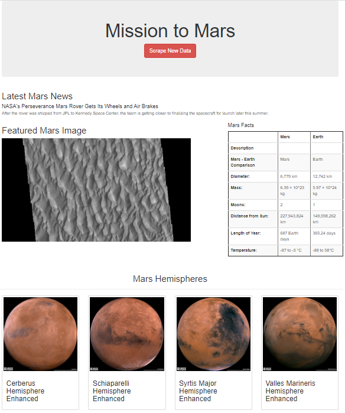

# Mission To Mars

## Purpose

The purpose of this project was to build an interactive webpage displaying current news, data, and images pertaining to Mars, scraped from other websites. 

## Methods

We used FLASK to create an instance of our web application where the user can press the button to "Scrape New Data" to update the page. This button navigates to a FLASK app route that calls the scrape_all function in the scraping.py file, initiating an automated Splinter browser that visits several specified websites. We used BeautifulSoup to parse the HTML of the sites, extracting headlines and image URLs, and Pandas to scrape data from tables. The results were stored in MongoDB and used to populate our web app's index page, which we customized using Bootstrap CSS styling. The final result is pictured below.

